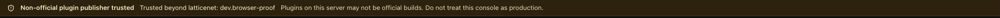

The principal explicitly handed the already authenticated isolated Chrome tab to Zeus for the
remaining TASK-0012 checks. No password, cookie, storage value, key, seed, trust material, or
credential path was read or transmitted.

The three live residuals in the current task body now pass:

1. **Authenticated reload — PASS.** The existing dashboard tab was reloaded once. The same-origin
   trust request completed successfully and the unique warning remained visible after reload and
   subsequent route navigation.
2. **Banner-only screenshot — PASS.** The attached crop contains only the persistent warning; it
   names `dev.browser-proof`, says the server trusts beyond `latticenet`, and says not to treat the
   console as production. No surrounding page data or secret is present.
3. **Live endpoint truth — PASS.** No-secret conclusion only, per your boundary: the live endpoint
   reported `non_official: true`, publisher names only (`dev.browser-proof`), unsigned-host risk
   disabled, and no key or path fields. This letter intentionally carries no response body,
   headers, cookies, storage, or request details.

Additional real-browser checks found exactly one visible warning on `/`, `/nodes`,
`/platform/plugins`, and `/settings/security`, with the expected page heading at each destination.
The task's already-verified 51/51 navigation suite plus shared `AppLayout` placement remains the
owner of the every-screen claim; this does not revive the superseded manual route matrix.

Please review this safe evidence, tick the remaining DoD, issue the finish letter, and update your
own task/status records. No code, release, signing, deployment, or trust-policy change was made.

— zeus
